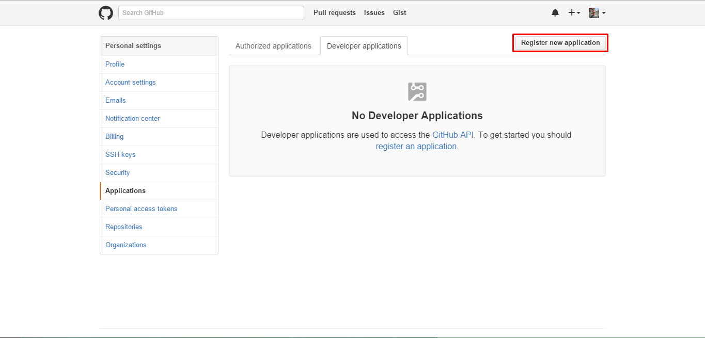
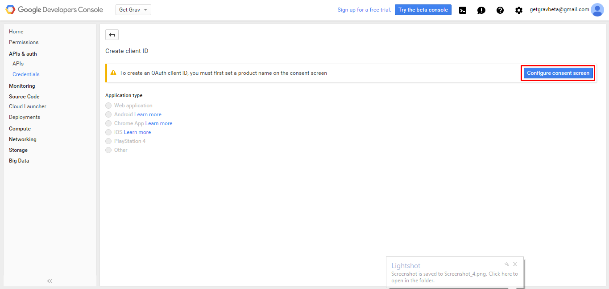

# Grav Login Plugin OAuth Add-On

The **Grav Login Plugin OAuth Add-On** for [Grav](http://github.com/getgrav/grav) adds the ability for users to log in using Social sites.

Currently Available Providers:
- Facebook
- Github
- Google
- Twitter
- LinkedIn

# Installation

The **login-oauth** plugin actually requires the help of the **login** plugin.

Both are available via GPM, and because the plugin has dependencies you just need to proceed and install the login-oauth plugin, and agree when prompted to install the others:

```
$ bin/gpm install login-oauth
```

# Usage

Add a login-protected page, then make sure you fill the "Route" in the Login plugin settings. Add this route to the callback url required by the OAuth application on the service desired. Example: `http://yoursite.com/login`.

>Note: OAuth has not been tested with Grav's multilang feature! Due to this, certain OAuth providers may not function properly on multilang sites

>IMPORTANT: `localhost` may NOT be used for callback and allowed URLs when creating OAuth provider applications due to certificate verification issues. Some services allow other URLs and it may be possible to add custom domains pointing to 127.0.0.1 in your hosts file and point applications there. GitHub and Twitter are tested to work on localhost too, if it does not work you can use a tunnel like ngrok to test locally

## Facebook

Visit https://developers.facebook.com/quickstarts/?platform=web and create an app name then click **Create New Facebook App ID.**

Choose a category most similar to your business then click **Create App ID.**

Scroll down on the next screen to the section titled **Tell us about your website.** Input a URL for the site (no need to include the protocol). Click **Next**

Click **Skip Quick Start** Copy the **App ID** and **App Secret** into the plugin configuration under Facebook.

On the left hand side click **Settings**
In the **Basic** tab add your domain into the **App Domains** section as well as enter a contact email (required for facebook developer program). In the **Product Settings** menu click "Facebook Login". Scroll down to the **Client OAuth Settings** Make sure that **Client OAuth Login** is enabled as well as **Web OAuth Login** is enabled. In the **Valid OAuth redirect URIs** section add the routes of all pages that are protected by login. This includes the domains. EX: `http://getgrav.org/`, `http://getgrav.org/login`, `http://getgrav.org/en/login`, and `http://getgrav.org/protected/page/route`

## Github

Visit Github's [Developer Applications Console](https://github.com/settings/developers) and press button **Register new application** (login if necesarry). 

Fill out the name and the URL (can be anything) and fill in the **callback**, which must be equal to where your grav site is located, generally just the host, i.e. `http://getgrav.org`. 

Copy **Client ID** and **client secret** into the plugin configuration under Github. Be sure to change `Github.enabled` to `true`

## Google

Visit the [Google Developers Console](https://console.developers.google.com) (sign in with a google account, preferably your businesses gmail).

Select **Create Project** and give the project a name (can be anything). Click **Create**. 

When it's finished creating in the left hand menu choose **Credentials** under **APIs & Auth** (you may need to click **APIs & Auth** in order to display **Credntials**). 

Under **Add credentials** (center of screen) select **OAuth 2.0 client ID**.

Then select **Configure consent screen** in the top right corner. 

The only requirement is **Product name** which should be the name of your website/business (not a url). You may fill in the other options as you want on the consent screen. (The consent screen can also be changed later). 

Then once you save the consent screen select **Web application** from the radio buttons and fill in the fields. **Name** being name of product/business. **Authorized Javascript origins** is the root domain name of the login page (no routes or wildcards) such as `http://getgrav.org`.

If needed, enter multiple sub domains, creating an entry for each. **Authorized redirect URIs** include the **same** Authorized Javascript origins used along with the **route** to the login page such as `http://getgrav.org/login`. Click **create**.


Copy **Client ID** and **client secret** into the plugin configuration under Google. Be sure to change `Google.enabled` to `true`

## Twitter

Login if necessary. Create a [new Twitter App](https://apps.twitter.com/app/new) , fill out name, application website, choose "Browser" as application type, choose the callback URL like above, default access type can be set to read-only, click on "Register application" and then you should be directed to your new application with the Client ID and secret ready to be copied and pasted into the YAML file.

## LinkedIn

Go to [your Apps section](https://developer.linkedin.com/docs/fields/basic-profile) in LinkedIn Developers, and create an application. After that you will get a **Client ID** and a **Client Secret** of your app, copy and paste them in the config file or use the admin panel.
